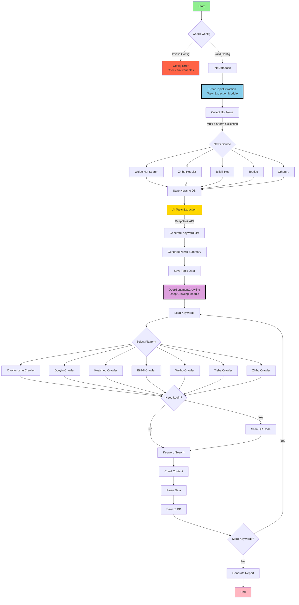

> [!warning]
> It seems that the daily hot news request API used in the project was recently banned. You can deploy [newsnow](https://github.com/ourongxing/newsnow) yourself. It can be deployed quickly with one click, then replace this URL. I will also commit a more general solution in the next month.
> ```python
> # News API Base URL
> BASE URL = "https://newsnow.busiyi.world"
> ```

# MindSpider - AI Crawler Designed for Public Opinion Analysis

> Disclaimer:
> All content in this repository is for learning and reference purposes only and is prohibited for commercial use. No person or organization may use the content of this repository for illegal purposes or infringe upon the legitimate rights and interests of others. The crawler technology involved in this repository is for learning and research only and must not be used for large-scale crawling of other platforms or other illegal activities. This repository assumes no liability for any legal responsibility arising from the use of the content of this repository. Use of the content of this repository constitutes your agreement to all terms and conditions of this disclaimer.

## Project Overview

MindSpider is an intelligent public opinion crawler system based on Agent technology. It automatically identifies hot topics through AI and performs precise content crawling across multiple social media platforms. The system adopts a modular design, enabling a fully automated process from topic discovery to content collection.

This part learns from and references the famous GitHub crawler project [MediaCrawler](https://github.com/NanmiCoder/MediaCrawler)

Two-step crawling:

- Module 1: Search Agent identifies hot news from **13** social media platforms and technical forums including Weibo, Zhihu, GitHub, Coolapk, etc., and maintains a daily topic analysis table.
- Module 2: Full-platform crawler deeply crawls fine-grained public opinion feedback for each topic.

<div align="center">


MindSpider Running Example
</div>

### Technical Architecture

- **Programming Language**: Python 3.9+
- **AI Framework**: Default Deepseek, supports multiple APIs (Topic Extraction & Analysis)
- **Crawler Framework**: Playwright (Browser Automation)
- **Database**: MySQL (Data Persistence)
- **Concurrency**: AsyncIO (Asynchronous Concurrent Crawling)

## Project Structure

```
MindSpider/
├── BroadTopicExtraction/           # Topic Extraction Module
│   ├── database_manager.py         # Database Manager
│   ├── get_today_news.py          # News Collector
│   ├── main.py                    # Module Entry Point
│   └── topic_extractor.py         # AI Topic Extractor
│
├── DeepSentimentCrawling/         # Deep Crawling Module
│   ├── keyword_manager.py         # Keyword Manager
│   ├── main.py                   # Module Entry Point
│   ├── platform_crawler.py       # Platform Crawler Manager
│   └── MediaCrawler/             # Multi-platform Crawler Core
│       ├── base/                 # Base Classes
│       ├── cache/                # Cache System
│       ├── config/               # Configuration Files
│       ├── media_platform/       # Platform Implementations
│       │   ├── bilibili/        # Bilibili Crawler
│       │   ├── douyin/          # Douyin Crawler
│       │   ├── kuaishou/        # Kuaishou Crawler
│       │   ├── tieba/           # Tieba Crawler
│       │   ├── weibo/           # Weibo Crawler
│       │   ├── xhs/             # Xiaohongshu Crawler
│       │   └── zhihu/           # Zhihu Crawler
│       ├── model/               # Data Models
│       ├── proxy/               # Proxy Management
│       ├── store/               # Storage Layer
│       └── tools/               # Toolset
│
├── schema/                       # Database Schema
│   ├── db_manager.py            # Database Management
│   ├── init_database.py         # Initialization Script
│   └── mindspider_tables.sql    # Table Structure Definition
│
├── config.py                    # Global Configuration
├── main.py                      # System Entry Point
├── requirements.txt             # Dependency List
└── README.md                    # Project Documentation
```

## System Workflow

### Overall Architecture Flowchart



### Workflow Description

#### 1. BroadTopicExtraction (Topic Extraction Module)

This module is responsible for the automatic discovery and extraction of daily hot topics:

1. **News Collection**: Automatically collect hot news from multiple mainstream platforms (Weibo, Zhihu, Bilibili, etc.)
2. **AI Analysis**: Use DeepSeek API to intelligently analyze news
3. **Topic Extraction**: Automatically identify hot topics and generate related keywords
4. **Data Storage**: Save topics and keywords to MySQL database

#### 2. DeepSentimentCrawling (Deep Crawling Module)

Based on the extracted topic keywords, perform deep content crawling on major social platforms:

1. **Keyword Loading**: Read extracted keywords for the day from the database
2. **Platform Crawling**: Use Playwright to automatically crawl on 7 major platforms
3. **Content Parsing**: Extract posts, comments, interaction data, etc.
4. **Sentiment Analysis**: Analyze sentiment tendency of crawled content
5. **Data Persistence**: Structure and store all data into the database

## Database Architecture

### Core Data Tables

1. **daily_news** - Daily News Table
   - Stores hot news collected from various platforms
   - Contains title, link, description, rank, etc.

2. **daily_topics** - Daily Topics Table
   - Stores AI-extracted topics and keywords
   - Contains topic name, description, keyword list, etc.

3. **topic_news_relation** - Topic-News Relation Table
   - Records the relationship between topics and news
   - Contains relation score

4. **crawling_tasks** - Crawling Tasks Table
   - Manages crawling tasks for each platform
   - Records task status, progress, results, etc.

5. **Platform Content Tables** (Inherited from MediaCrawler)
   - xhs_note - Xiaohongshu Notes
   - douyin_aweme - Douyin Videos
   - kuaishou_video - Kuaishou Videos
   - bilibili_video - Bilibili Videos
   - weibo_note - Weibo Posts
   - tieba_note - Tieba Posts
   - zhihu_content - Zhihu Content

## Installation & Deployment

### Requirements

- Python 3.9 or higher
- MySQL 5.7 or higher
- Conda environment: pytorch_python11 (Recommended)
- OS: Windows/Linux/macOS

### 1. Clone Project

```bash
git clone https://github.com/yourusername/MindSpider.git
cd MindSpider
```

### 2. Create and Activate Environment

#### Conda Configuration Method

#### Conda Configuration Method

```bash
# Create conda environment named pytorch_python11 with specified Python version
conda create -n pytorch_python11 python=3.11
# Activate environment
conda activate pytorch_python11
```

#### UV Configuration Method

> [UV is a fast, lightweight Python package and environment management tool, suitable for low dependencies and convenient management. Ref: https://github.com/astral-sh/uv]

- Install uv (if not installed)
```bash
pip install uv
```
- Create virtual environment and activate
```bash
uv venv --python 3.11 # Create 3.11 environment
source .venv/bin/activate   # Linux/macOS
# OR
.venv\Scripts\activate      # Windows
```


### 3. Install Dependencies

```bash
# Install Python dependencies
pip install -r requirements.txt

OR
# UV version is faster
uv pip install -r requirements.txt


# Install Playwright browser drivers
playwright install
```

### 4. Configure System

Copy `.env.example` to `.env` in the project root directory. Edit the `.env` file to set database and API configurations:

```python
# MySQL Database Configuration
DB_HOST = "your_database_host"
DB_PORT = 3306
DB_USER = "your_username"
DB_PASSWORD = "your_password"
DB_NAME = "mindspider"
DB_CHARSET = "utf8mb4"

# DeepSeek API Key
MINDSPIDER_BASE_URL=your_api_base_url
MINDSPIDER_API_KEY=sk-your-key
MINDSPIDER_MODEL_NAME=deepseek-chat
```

### 5. Initialize System

```bash
# Check system status
python main.py --status

# Initialize database tables
python main.py --setup
```

## User Guide

### Complete Workflow

```bash
# 1. Run topic extraction (Get hot news and keywords)
python main.py --broad-topic

# 2. Run crawler (Crawl content from platforms based on keywords)
python main.py --deep-sentiment --test

# OR run complete workflow at once
python main.py --complete --test
```

### Use Modules Separately

```bash
# Only get today's hot topics and keywords
python main.py --broad-topic

# Only crawl specific platforms
python main.py --deep-sentiment --platforms xhs dy --test

# Specify date
python main.py --broad-topic --date 2024-01-15
```

## Crawler Configuration (Important)

### Platform Login Configuration

**Login to each platform is required for first-time use, this is the most critical step:**

1. **Xiaohongshu Login**
```bash
# Test Xiaohongshu crawling (QR code will pop up)
python main.py --deep-sentiment --platforms xhs --test
# Scan QR code with Xiaohongshu APP, status will be saved automatically after login
```

2. **Douyin Login**
```bash
# Test Douyin crawling
python main.py --deep-sentiment --platforms dy --test
# Scan QR code with Douyin APP
```

3. **Other Platforms Similarly**
```bash
# Kuaishou
python main.py --deep-sentiment --platforms ks --test

# Bilibili
python main.py --deep-sentiment --platforms bili --test

# Weibo
python main.py --deep-sentiment --platforms wb --test

# Tieba
python main.py --deep-sentiment --platforms tieba --test

# Zhihu
python main.py --deep-sentiment --platforms zhihu --test
```

### Login Troubleshooting

**If login fails or gets stuck:**

1. **Check Network**: Ensure you can access the corresponding platform
2. **Close Headless Mode**: Edit `DeepSentimentCrawling/MediaCrawler/config/base_config.py`
   ```python
   HEADLESS = False  # Change to False to see browser interface
   ```
3. **Manual Verification**: Some platforms may require manual slider verification
4. **Re-login**: Delete `DeepSentimentCrawling/MediaCrawler/browser_data/` directory and login again

### Crawling Parameter Adjustment

Suggested to adjust crawling parameters before actual use:

```bash
# Small scale test (Recommended for first test)
python main.py --complete --test

# Adjust crawling quantity
python main.py --complete --max-keywords 20 --max-notes 30
```

### Advanced Features

#### 1. Specify Date Operation
```bash
# Extract topics for specific date
python main.py --broad-topic --date 2024-01-15

# Crawl content for specific date
python main.py --deep-sentiment --date 2024-01-15
```

#### 2. Specify Platform Crawling
```bash
# Only crawl Xiaohongshu and Douyin
python main.py --deep-sentiment --platforms xhs dy --test

# Crawl specific quantity of content from all platforms
python main.py --deep-sentiment --max-keywords 30 --max-notes 20
```

## Common Arguments

```bash
--status              # Check project status
--setup               # Initialize project
--broad-topic         # Topic extraction
--deep-sentiment      # Crawler module
--complete            # Complete workflow
--test                # Test mode (small amount of data)
--platforms xhs dy    # Specify platforms
--date 2024-01-15     # Specify date
```

## Supported Platforms

| Code | Platform | Code | Platform |
|-----|-----|-----|-----|
| xhs | Xiaohongshu | wb | Weibo |
| dy | Douyin | tieba | Tieba |
| ks | Kuaishou | zhihu | Zhihu |
| bili | Bilibili | | |

## FAQ

### 1. Crawler Login Failed
```bash
# Issue: QR code not showing or login failed
# Solution: Close headless mode, login manually
# Edit: DeepSentimentCrawling/MediaCrawler/config/base_config.py
HEADLESS = False

# Re-run login
python main.py --deep-sentiment --platforms xhs --test
```

### 2. Database Connection Failed
```bash
# Check status
python main.py --status

# Check if database config in config.py is correct
```

### 3. Playwright Install Failed
```bash
# Re-install
pip install playwright

OR

uv pip install playwright

playwright install
```

### 4. Zero Crawled Data
- Ensure platform login successful
- Check if keywords exist (run topic extraction first)
- Use test mode to verify: `--test`

### 5. API Call Failed
- Check if DeepSeek API key is correct
- Confirm API quota is sufficient

## Notes

1. **Must login to platforms first before first use**
2. **Recommend using test mode for verification first**
3. **Comply with platform usage rules**
4. **For learning and research purposes only**

## Project Development Guide

### Extend New News Source

Add new news source in `BroadTopicExtraction/get_today_news.py`:

```python
async def get_new_platform_news(self) -> List[Dict]:
    """Get hot news from new platform"""
    # Implement news collection logic
    pass
```

### Extend New Crawler Platform

1. Create new platform directory under `DeepSentimentCrawling/MediaCrawler/media_platform/`
2. Implement core modules for the platform:
   - `client.py`: API Client
   - `core.py`: Crawler Core Logic
   - `login.py`: Login Logic
   - `field.py`: Data Field Definition

### Database Extension

Update `schema/mindspider_tables.sql` if adding new tables or columns, and run:

```bash
python schema/init_database.py
```

## Performance Optimization Suggestions

1. **Database Optimization**
   - Regularly clean up historical data
   - Build indexes for frequently queried fields
   - Consider using partition tables for large data management

2. **Crawling Optimization**
   - Set reasonable crawling intervals to avoid being limited
   - Use proxy pool to improve stability
   - Control concurrency to avoid resource exhaustion

3. **System Optimization**
   - Use Redis to cache hot data
   - Asynchronous task queue for time-consuming operations
   - Regularly monitor system resource usage

## API Interface Description

The system provides Python API for secondary development:

```python
from BroadTopicExtraction import BroadTopicExtraction
from DeepSentimentCrawling import DeepSentimentCrawling

# Topic Extraction
async def extract_topics():
    extractor = BroadTopicExtraction()
    result = await extractor.run_daily_extraction()
    return result

# Content Crawling
def crawl_content():
    crawler = DeepSentimentCrawling()
    result = crawler.run_daily_crawling(
        platforms=['xhs', 'dy'],
        max_keywords=50,
        max_notes=30
    )
    return result
```

## License

This project is for learning and research purposes only, please do not use it for commercial purposes. Please comply with relevant laws and regulations and platform service terms when using this project.

---

**MindSpider** - Empowering Public Opinion Insight with AI, Your Intelligent Content Analysis Assistant
